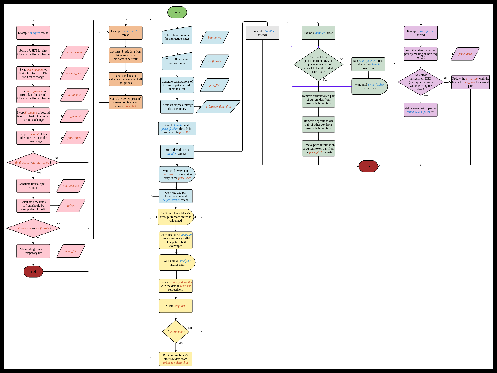

# LibArbitrage

<p align="center">
<!-- linkedin -->
<a href="https://www.linkedin.com/in/%C5%9Fefik-efe/"></a>&nbsp;
<!-- twitter -->
<a href="https://twitter.com/f4T1H21"></a>&nbsp;
<!-- PyPI -->
<a href="https://pypi.org/project/libarbitrage/"></a>&nbsp;
<!-- status -->
<a href="#"></a>&nbsp;
<!-- license -->
<a href="https://www.gnu.org/licenses/gpl-3.0.html"></a>&nbsp;
<!-- code size -->
<a href="#"></a>
</p>

_An extensible library allows to analyze DEX-to-DEX arbitrage oportunities autonomously, besides advanced decentralized exchange operations_

## License
This project is licensed under the _GNU General Public License Version 3.0_<br>
See [LICENSE](LICENSE) for more information.

## Legal Disclaimer
It is the end user's responsibility to obey all applicable local, state and federal laws. I assume no liability and am not responsible for any misuse or damage caused by this software, documentation and anything in this repository and the packages on the python package index.

## This is not an investment advice
Neither the outputs of LibArbitrage nor any information in this repository constitutes professional and/or financial advice.

## Table of Content
- [About the Project](#about-the-project)
- [Installation](#installation)
- [Documentation](#documentation)
- [Technical Details](#technical-details)
- [Flowchart Algorithm](#algorithm)

## About the Project
This is a Python library developed to calculate and analyze arbitrage opportunities between decentralized exchanges of Ethereum blockchain network. Meanwhile, the library makes it easy to process the data of arbitrage opportunities that belong to different blocks in blockchain as long as the blocks are analyzed.

## Installation
Library is available at [PYthon Package Index](https://pypi.org/project/libarbitrage/).
```console
pip install libarbitrage
```

## Documentation
__Attention:__ You must have an [Infura](https://www.infura.io/) APIKEY that works on Ethereum network in order for program to fetch latest blocks' data while analyzing.

For now, the number of available exchanges and tokens to use in analyzes are limited. They may be expanded in the upcoming releases.

#### Available exchanges (DEX):
- `uniswap`: Uniswap Version 3
- `sushiswap`: Sushiswap

#### Available tokens (ERC-20):
- `ftt`: FTX
- `eth`: WETH
- `btc`: WBTC
- `aave`: AAVE
- `usdt`: Tether
- `cels`: Celsius
- `usdc`: USD Coin
- `link`: Chainlink

### Functions
#### arbitrage()
Initializes an arbitrage analyze loop between specified `tokens` on specified `exchanges`.

##### Arguments:
- `APIKEY`: Required. A string of valid Infura APIKEY which should be working on Ethereum main network.<br>
- `interactive`: Required. The program outputs data if it's set to `True`; if `False`, it doesn't. In both cases all the arbitrage data will be stored on an internal variable, which can be retrieved through the function [`getArbitrageData()`](#getarbitragedata).<br>
- `exchanges`: Optional. (default: all of the [availables](#available-exchanges-dex)) A list of DEXes that program uses to get price datas of tokens.<br>
- `tokens`: Optional. (default:all of the [availables](#available-tokens-erc-20)) A list of tokens whose price will be analyzed between exchanges during the operation.<br>
- `operation`: Optional. (default: `sell`) A string of trading operation being done while getting price data. (Sell price/Buy price)<br>
- `min_revenue`: Optional. (default: `0`) Minimum profit rate of a unit transaction in percentage.

#### getArbitrageData()
Returns the results of arbitrage analyze as a dictionary having block numbers as keys and that block's arbitrage data (list) as value. See [this](#reading-the-data) for a real case. Here's the format:
```
{
    block_number(int): [
        {'blocknum': block_number(int), 'timestamp': block's_timestamp(int), 'dex1': dex_name(str), 'dex2': dex_name(str), 'sell_token': token_name(str), 'buy_token': token_name(str), 'revenue_per_1usd': (float), 'minimum_amount': min_amount_to_pay_txfee(float)},
        {'blocknum': block_number(int), 'timestamp': block's_timestamp(int), 'dex1': dex_name(str), 'dex2': dex_name(str), 'sell_token': token_name(str), 'buy_token': token_name(str), 'revenue_per_1usd': (float), 'minimum_amount': min_amount_to_pay_txfee(float)}
        ]
    .
    .
    .
}
```

#### printFormattedData()
Prints a whole block of arbitrage data in the form of a table.

##### Arguments:
- `liste`: Required. A list of arbitrage datas (dict) which belong to the same block.

### Initializing an arbitrage analyze

#### Interactive (monitor) mode
Because the program acts like a monitor, this mode is named "monitor" mode. It takes the `min_revenue` argument of interactively. Even if you specify a `min_revenue` value to the function, it will be overwritten by the interactively taken input.
An example initialization on interactive mode can be watched below.<br>

https://user-images.githubusercontent.com/83399767/205143445-285838d4-0177-47c2-a586-cc0a843ab56d.mp4

Click [this YouTube link](https://youtu.be/AXpGRdGLOpY) if the video doesn't play properly.

#### Non-interactive (developer) mode
Because all the program works on a seperated thread -hence we can work on the data further-, this mode is named "developer mode".

Begin by importing the LibArbitrage module:
```python
>>> import libarbitrage
```

Set variables to pass as arguments:
```python
>>> APIKEY = 'YOUR_INFURA_APIKEY'
>>> tokens = ['eth', 'btc', 'ftt', 'aave', 'usdc', 'usdt'] # Tokens to analyze between
>>> revenue= 1.5 # Minimum amount of revenue in percentage per one USDT 
```

A single function startes and manages all the process of arbitrage analyze.
```python
>>> libarbitrage.arbitrage(APIKEY=APIKEY, tokens=tokens, min_revenue=revenue)
```

After a while (depending on the number of tokens specified), we are able to retrieve the result of arbitrage analyze respectively:

```python
>>> arbitrage_data = libarbitrage.getArbitrageData()
>>> type(arbitrage_data)
<class 'dict'>
```

The data dictionary is updated whenever the arbitrage analyze of a new block in blockchain is done.
```python
>>> from time import sleep
>>> len(arbitrage_data)
2
>>> sleep(20)
>>> len(arbitrage_data)
3
```

##### Reading the data
And now we can process or do whatever we want with it. Let's see which blocks are analyzed so far.
```python
>>> print(arbitrage_data.keys())
dict_keys([15981551, 15981554, 15981558])
>>> arbitrage_data.get(15981558)
[{'blocknum': 15981558, 'timestamp': 1668589283, 'dex1': 'uniswap', 'dex2': 'sushiswap', 'sell_token': 'eth', 'buy_token': 'ftt', 'revenue_per_1usd': 0.022585200456361365, 'minimum_amount': 190.20624952552157}, {'blocknum': 15981558, 'timestamp': 1668589283, 'dex1': 'sushiswap', 'dex2': 'uniswap', 'sell_token': 'btc', 'buy_token': 'aave', 'revenue_per_1usd': 0.07117425741710715, 'minimum_amount': 60.356741741769994}, {'blocknum': 15981558, 'timestamp': 1668589283, 'dex1': 'uniswap', 'dex2': 'sushiswap', 'sell_token': 'usdc', 'buy_token': 'ftt', 'revenue_per_1usd': 0.44948651720318966, 'minimum_amount': 9.557230549019256}]
```

Every single item in above list, is an arbitrage opportunity for that particular block. These opportunities are calculated and filtered by taking the parameters specified in the `arbitrage()` function into account.

We can also pretty print these data. Let's use the latest analyzed block's data for this. To do that we need to get the last key's value from the `arbitrage_data` dictionary:

```python
>>> last_key = list(arbitrage_data)[-1]
>>> print(last_key)
15981558
>>> data = arbitrage_data.get(last_key)
>>> libarbitrage.printFormattedData(data)

┌─────────┬────────────────────┬──────────┬──────────┬─────┬─────┬──────────────────────┬───────────────────┐
│BLOCK NUM│LOCAL TIMESTAMP     │DEX1      │DEX2      │SELL │BUY  │UNIT REVENUE          │THRESHOLD AMOUNT   │
├─────────┼────────────────────┼──────────┼──────────┼─────┼─────┼──────────────────────┼───────────────────┤
│15981558 │2022-11-16 12:01:23 │uniswap   │sushiswap │eth  │ftt  │0.0225852004563613650 │190.20624952552157 │
│15981558 │2022-11-16 12:01:23 │sushiswap │uniswap   │btc  │aave │0.0711742574171071500 │60.356741741769994 │
│15981558 │2022-11-16 12:01:23 │uniswap   │sushiswap │usdc │ftt  │0.4494865172031896600 │9.5572305490192560 │
├─────────┼────────────────────┼──────────┼──────────┼─────┼─────┼──────────────────────┼───────────────────┤
```

#### Understanding the table
Here in the table above, there're eight different types of data listed for one arbitrage opportunity in a particular block.

"BLOCK NUM": Is the number of block that has the arbitrage opportunity<br>
"LOCAL TIMESTAMP": Is the locally formatted time corresponding to block timestamp<br>
"DEX1": Is the first DEX used in arbitrage<br>
"DEX2": Is the second DEX used in arbitrage<br>
"SELL": First token used in arbitrage<br>
"BUY": Second token used in arbitrage<br>
"UNIT REVENUE": The revenue of arbitrage done with 1 USDT<br>
"THRESOLD AMOUNT": The minimum amount of USDT to afford the transaction fees using the revenue comes from arbitrage<br> 

See pink colored analyzer threads on [flowchart algorithm](#algorithm) for more information.


## Technical Details
LibArbitrage adopts an efficient multithread approach for calculating arbitrage opportunities. There're three main __types__ of threads running simultaneously: "_handler_", "_price_fetcher_" and "_analyzer_".

All these three types of threads are generated at a same number, which is calculated depending on the number of specified tokens. Below formula indicates the total number of threads initialized at the beginning of the program. Some of them may terminate further, in case of any errors occured by decentralized exchange; for example liquidity errors.<br>

```
P: Permutation
t: number of specified tokens
n: number of initialized threads

n = 2 * P(t, 2) * 3
    |             └→ Number of different thread types (excluding tx_fee_fetcher thread)
    └→ Because threads are generated for both DEXes, multiply the number with two.
```

Below flowchart shows the working algorithm of LibArbitrage shallowly.<br>
### Algorithm


<br>

___─ Written by f4T1H21 ─___
